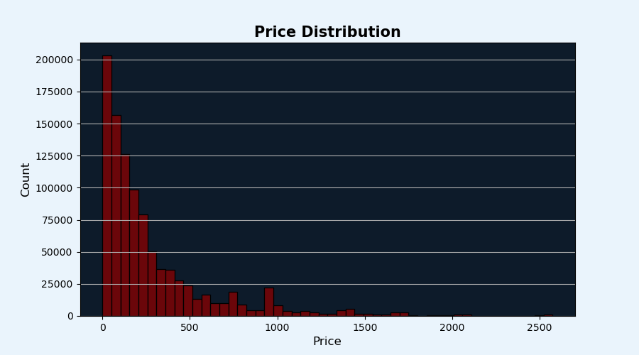

# 🛒 E-commerce User Journey & Funnel Analysis

## 🔹 Project Objective
Why do thousands of users add products to their carts but never complete the purchase?  
Where in the customer journey do we lose the most users—during browsing, adding to cart, or at checkout?  
Which product categories face the highest drop-offs, and how do these patterns impact overall revenue?  

This project explores a *large-scale e-commerce dataset* to map the user journey from *product views → add to cart → purchases*.  
Through conversion funnels, time-based trends, and category-level insights, it uncovers bottlenecks, highlights high-value products and categories, and provides actionable recommendations to improve conversions and enhance user engagement.

---

## 🔹 Dataset
- *Source:* Kaggle Dataset/ eCommerce Multi-category online store
- *Dataset Link:*  https://www.kaggle.com/datasets/mkechinov/ecommerce-behavior-data-from-multi-category-store
- *Dataset Duration:* October 2019 – November 2019  
- *Rows Analyzed:* 10 lakh rows  
- *Columns:*  
  - event_time – Timestamp of the event  
  - event_type – Type of event (view, cart, purchase)  
  - product_id – Unique product identifier  
  - category_id – Category ID  
  - category_code – Hierarchical category (main.sub.subsub)  
  - brand – Product brand  
  - price – Product price  
  - user_id – Unique user identifier  
  - user_session – Session identifier  

> Each row represents a user-product interaction, reflecting the e-commerce platform’s behavioral data.

---

## 🔹 Analysis Steps
1. *Data Cleaning & Preprocessing*  
   - Removed duplicates and handled missing values for category_code, brand, and category_id  
   - Standardized event_time and extracted event_hour, event_month, is_weekend  
   - Stripped and cleaned categorical columns  

2. *Exploratory Data Analysis (EDA)*  
   - Event type distribution (view, cart, purchase)  
   - Top categories, sub-categories, and brands  
   - Price distribution analysis (histogram and boxplot)  
   - Top products by count and revenue  
   - Repeat customer purchases  

3. *Conversion Funnel & Drop-Off Analysis*  
   - Conversion rates between view → cart → purchase  
   - Drop-off analysis by main category  

4. *Revenue Analysis*  
   - Revenue contribution by main category (Pareto analysis)  

5. *Time-Based Analysis*  
   - Purchases by hour, weekday/weekend, and month  

---

## 🔹 Analysis & Key Visualizations
### 📊 Event Type Distribution
- Shows majority of events are *views, followed by **purchases* and *cart additions*.

 
### 🏷 Top Categories by Repeat Customer Purchases
- Electronics, smartphones, and some unknown categories dominate user interactions.

### 💵 Price Distribution
- Most products fall in the *0–500* price range. Outliers extend up to *2200*.

### 🛒 Conversion Funnel
- Highest conversion occurs at *cart → purchase* stage; major drop-offs occur at *view → cart* stage.

### 📈 Drop-off Analysis by Funnel Stages

## 📊 Explore More Visualizations

Only a few key charts are shown here. For the detailed visualizations with storytelling insights, explore the full [Jupyter Notebook](./Jupyter-Notebook/E-commerce%20User%20Journey%20Analysis.ipynb) or check [Visualizations](./images)

---

## 🔹 Insights & Key Findings
- *Event Funnel:* Conversion is strongest at cart → purchase; highest drop-off is during product browsing.  
- *Revenue Contribution:* Electronics dominate total revenue; smaller categories cumulatively reach 100%.  
- *Repeat Customers:* Few users contribute to multiple purchases, highlighting potential for loyalty programs.  
- *Time Trends:* Peak purchase hours are *4–8 PM*; weekend impact is limited due to dataset constraints.  
- *Top Products & Categories:* Smartphones and electronics products dominate both in volume and revenue.

---

## 🔹 Business Recommendations
- Optimize Conversion Funnel:
With a 95% drop-off between view and cart, the product detail page needs redesign (clear CTAs, better product descriptions, high quality images, reviews, and trust signals) and limited-time offers .
- Focus on Electronics Category:
Electronics, especially smartphones, generate the majority of revenue. Prioritize exclusive deals, bundling offers, and loyalty programs in this category specially for top-performing products.
- Recover Abandoned Carts:
High cart-to-purchase conversions are good, but further gains can come by targeting personalized reminders and limited-time offers for abandoned carts.
- Leverage Pricing Insights:
Most products sell in the ₹0-500 range, but premium products exist with low volume, optimize pricing strategies, highlight premium products selectively, and consider discounts to boost sales.
- Leverage Peak Hours & Weekends:
Since purchases spike between 4–8 hours and weekends show intense activity, schedule promotions, flash scales, and targated notifications during these windows to maximize engagement and conversions.
- Engage Repeat Customers:
A small set of repeat users drive disproportionately high purchases. Implement personalized discounts, VIP rewards, early access sales, and referral programs to retain and grow this segment.
- Diversify Beyond Electronics:
Since revenue is highly concentrated, introduce cross-selling strategies for low-performing categories like medicine, stationery, and kids to reduce dependency on electronics.

---

## 🔹 Conclusion
This project analyzed *10 lakh rows of e-commerce events* to reveal patterns in user behavior from *views → cart → purchases*.  
Through *conversion funnels, category-level insights, and revenue analysis*, businesses can identify bottlenecks, optimize conversions, and increase revenue, providing a structured and actionable approach to enhancing the e-commerce user experience.
